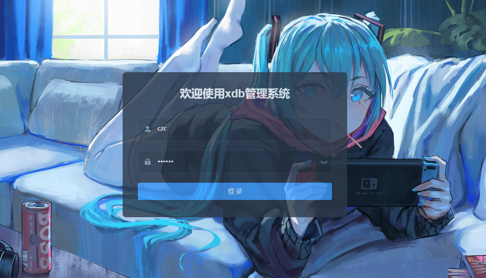
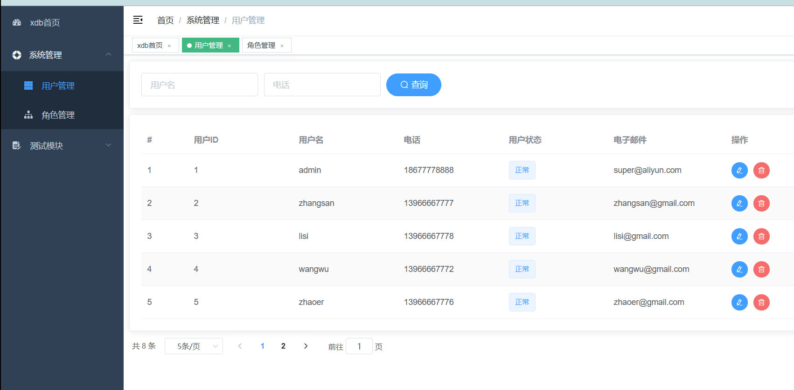

## xdb-admin -project

### 后台管理系统

#### 1、项目介绍

SpringBoot+Vue后台管理系统，前后端分离，可以对进行增删改查操作

#### 2、项目技术

后端框架： SpringBoot，MybatisPlus，Redis

前端技术：Vue，Element-ui

#### 3、开发环境

- Java版本：JDK1.8（必须）
- IDE类型：IDEA
- 数据库类型：MySql
- 硬件环境：Windows

#### 4. 项目截图

1. 登录界面

   

2. 系统界面

   
